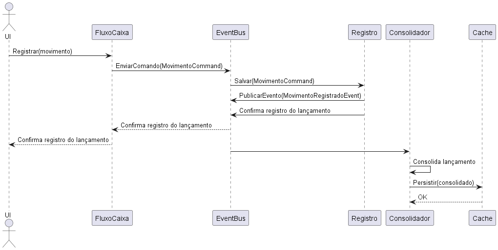

# Exemplo Fluxo de Caixa

* Essa arquitetura foi projetada pensando em atender a necessidade de baixo acoplamento entre os componentes do sistema e na possibilidade de escalar a aplicação em cenários de aumento do volume de transações.

## Arquitetura 

* Em atendimento ao objetivo do estudo, optou-se no uso de uma arquitetura baseada em eventos com os seguintes componentes:
  - [RabbitMQ](https://www.rabbitmq.com/) - Utilizada para habilitar a arquitetura baseada em eventos
  - [Microsoft Sql Server](https://www.microsoft.com/pt-br/sql-server/sql-server-2019) - Banco de dados transacional utilizado para persistir informações transacionais do negócio.
  - [MongoDb](https://www.mongodb.com/)  - Banco de dados desnormalizado contendo as views no padrão das consultas consumidoras visando maior desempenho na recuperação dos dados.


## Fluxo da informação

* O diagrada a seguir é apresentado fluxo da informação entre os componentes do sistema.
 


## Domínio da aplicação

* Essa sessão apresenta o modelo de negócio da aplicação em questão.


# Configuracções 

* Chaves do appsettings que precisam serem ajustadas

``` appsettings.json
  "ConnectionStrings": {
    "SqlServer": "Server=[Informar a instância do sql server];Database=ControleCaixa;Trusted_Connection=True;MultipleActiveResultSets=true"
  },
  "MessageQueueConnection": {
    "MessageBus": "host=[Informar o host e porta para conexão ao habbitMq];publisherConfirms=true;timeout=10"
  }
```

# Referências:

[Diagramas do projeto](https://real-world-plantuml.com/)
[Biblioteca de conexão com HabbitMq](https://github.com/EasyNetQ/EasyNetQ/wiki/Introduction)
